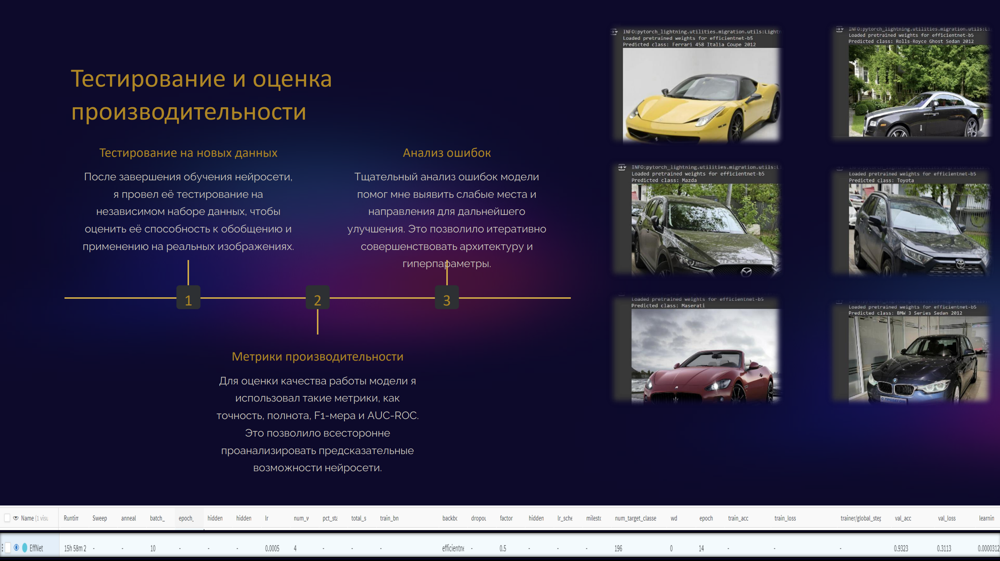

# 🚘 Определение марки автомобиля по фотографии

Проект по классификации марки автомобиля на изображении с помощью сверточных нейросетей.

  
  

---

## 📌 Описание проекта

В этом проекте мы:

1. Собираем датасет изображений автомобилей разных марок.  
2. Выполняем предобработку: выравнивание, обрезка, аугментации (повороты, масштаб, яркость).  
3. Реализуем и обучаем CNN (ResNet50 / EfficientNet) для классификации марок.  
4. Оцениваем качество модели метриками accuracy, precision, recall.  
5. Строим матрицу ошибок и визуализируем наиболее частые ошибки.

---

## 🛠️ Технологии

- Python 3.8+  
- PyTorch  
- torchvision  
- Albumentations  
- scikit-learn  
- matplotlib / seaborn  
- Jupyter Notebook  

---
